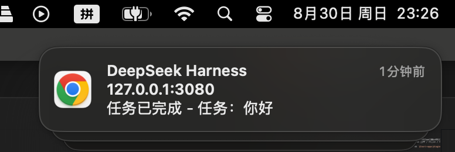

# dsh-notifier-plugin

[English](README.md) | 中文

[DeepSeek Harness (dsh)](https://github.com/deepseek-ai/deepseek-harness) 的桌面通知插件：运行结束时发送系统通知；会话进行中模型提问（`ask_user_question`）或等待审批（沙箱提权 / 工具权限）时也会即时提醒你回来处理。正文按结果区分（成功 / 失败 / 中止 / 达到 token 上限 / 被阻塞 / 被中断）。打包插件时可选两种发送方案：浏览器原生 `Notification()`（默认）或 Tauri 的 `@tauri-apps/plugin-notification`。



## 安装

### 从 npm 安装（推荐）

已发布的 npm 包包含预构建的浏览器端产物，无需本地构建权限：

```sh
dsh plugin --profile web add dsh-notifier-plugin
```

### 从 GitHub 安装

也可以直接从 git 仓库安装源码，`prepare` 脚本会在安装后自动构建：

```sh
dsh plugin --profile web add github:hotpot-labs/dsh-notifier-plugin
```

> pnpm ≥10 默认禁止 git 依赖执行构建脚本。若安装时跳过了构建，在对应 profile 的 `pnpm-workspace.yaml` 中授权后重新 add：
>
> ```yaml
> allowBuilds:
>   dsh-notifier-plugin: true
> ```

### 本地安装

本地目录安装（开发调试用，改动后重新构建即可）：

```sh
dsh plugin --profile web add ./dsh-notifier-plugin
```

安装命令在 profile 目录执行 `pnpm add`，并把声明了 `dsh.bundle` 的包追加进 `dsh.profile.bundles`。

验证挂载：

```sh
dsh --profile web --dump-config | grep -n dsh-notifier
```

### Tauri 桌面壳

1. 构建 Tauri 变体：`pnpm run build:tauri`（只重打客户端 bundle 则用 `DSH_NOTIFIER_BACKEND=tauri tsdown`）。
2. 宿主 Tauri 应用必须安装 Rust 侧：`src-tauri/Cargo.toml` 加 `tauri-plugin-notification` + `.plugin(tauri_plugin_notification::init())`，并在 capabilities 中授予 `notification:default`。缺失时权限请求会失败，通知被跳过（控制台告警一次）。前台抑制用的 `isFocused` 属于 `core:window:default`（随 `core:default` 授予），无需额外 capability。

## 配置

两种方式，用户层优先于入口配置：

**Web UI（推荐）**：打开 `dsh web` → **Settings → Plugins → Plugin configuration** → 展开通知插件卡片，切换开关后 Save。

**配置文件**：在 profile 的 `cordis.patch.yml`（`~/.dsh/profiles/<name>/cordis.patch.yml`）声明：

```yaml
- id: dsh-notifier
  name: dsh-notifier-plugin
  config:
    enabled: true        # 总开关；false 全部静默
    title: DeepSeek Harness
    sound: true          # 允许平台提示音；false 请求静默投递
    onBlocked: true      # 阻塞通知（提问 + 审批）总开关
    onQuestion: true     # 提问通知（仅在 onBlocked 开启时生效）
    onApproval: true     # 审批通知（仅在 onBlocked 开启时生效）
```

所有字段均可选，默认值如上。注意后一层会**整体替换**同 id 行的 `config`（不是逐 key 深合并）。

## 使用

1. 安装完成后**重启 web 进程**（`dsh --profile web web`）并硬刷新页面。
2. 授予通知权限：打开设置卡片点「发送测试通知」——这是推荐方式，因为浏览器要求 `requestPermission()` 必须伴随用户手势。
3. 在卡片中切换各项开关，改动即时生效，无需重启。

> 只有在 dsh 网页（或 Tauri 桌面窗口）打开时才会发通知——投递发生在 webview 里，没有页面连接的 headless CLI 运行不会产生通知。

### 通知正文

| 事件 | 正文 |
| --- | --- |
| 运行完成 | `任务已完成 - 任务：<会话标题>` |
| 运行失败 | `任务失败 - 任务：…` |
| 中止 / token 上限 / 被阻塞 / 被中断 | `任务已中止` / `任务达到 token 上限` / `任务被阻塞` / `任务被中断` |
| 提问 | `需要回答：<问题文本> — <会话标题>` |
| 审批 | `需要批准：<工具名> — <原因> — <会话标题>` |

会话标题取自会话列表行（宿主投影），极早的通知可能还没有标题。

### 权限

- **浏览器**：第一条通知（或卡片上的「发送测试通知」按钮）会触发权限请求。注意：现代 Chrome 对**没有用户手势**的 `requestPermission()` 会静默拒绝——如果第一条真实通知没有弹出授权框，点一次「发送测试通知」（真实点击算手势）。如果之前拒绝过，需要在浏览器的网站设置里重新允许该站点的通知。
- **Tauri**：经通知插件的 `requestPermission()` 授予；macOS 首次使用时系统层面可能还会再问一次。

#### macOS：系统层仍然可能拦截横幅

即使站点权限已授予，横幅是否出现由 macOS 决定：

1. **系统设置 → 通知 → Google Chrome**（或你的浏览器 / Tauri 应用）：打开**允许通知**，样式选**横幅**（「提醒」也可以，但要手动关闭）。Chrome 的网页通知实际经由 **Google Chrome Helper (Alerts)** 投递——如果列表里有这个条目，一并检查。
2. **专注模式 / 勿扰**：开启时横幅被静默吞掉，任何地方都不会报错。
3. 在 dsh 页面的 DevTools 控制台快速自测：
   ```js
   Notification.permission                       // 必须是 "granted"
   new Notification('测试', { body: '手动测试' })  // 已授权但没横幅 => 系统层拦截
   ```
   手动这条也不弹，问题就在 macOS 设置，与插件无关。

插件把每次投递决策打到 debug 级日志（控制台按 `dsh-notifier-plugin` 过滤）：`notify delivered` 表示通知已成功构造——此后没横幅就是系统/浏览器层；`notify skipped (permission)` 表示站点权限缺失。

## 功能特性

- **一次运行只通知一次**：记录根会话最近一次 `turn/end` 的结果，等会话从 running 翻转为静止（整个活动收敛）才发 —— 多轮 goal 运行只在最后弹一条，且带真实最终结果。
- **会话中阻塞即时通知**：模型调用 `ask_user_question` 或审批等待时立即提醒；可用 `onBlocked` / `onQuestion` / `onApproval` 精细控制。
- **只通知顶层运行**：按会话列表行的 `origin === 'subagent'` 过滤子代理会话，一次运行只弹一条。
- **前台不打扰**：你正看着 dsh 时不弹系统通知——web 端指 dsh 所在 tab 可见且浏览器窗口聚焦（`visibilityState` + `hasFocus`），Tauri 桌面端指应用主窗口聚焦（`getCurrentWindow().isFocused()`）。控制台打 `notify suppressed (app in foreground)`；设置卡片的「发送测试通知」不受此限制。
- **web 设置卡片**：所有选项可在 **Settings → Plugins → Plugin configuration** 里编辑，样式与内置插件卡片一致；改动即时生效，无需重启。卡片还带「发送测试通知」按钮——这是授予浏览器通知权限的推荐方式（权限请求需要用户手势）。
- **订阅自愈**：事件流断开后自动重连；通知失败只告警一次并吞掉，绝不破坏它所汇报的运行。

## 开发

### 工作原理

插件的浏览器侧（`src/client/`）自己并开一对宿主事件流（`events.mux` / `events.host` —— 宿主实现是多订阅者的），在与宿主侧完全一致的 `session/event` 透传帧上驱动通知状态机。宿主侧只持有 `dsh-notifier` 设置命名空间（schema + 用户层），设置卡片与通知运行时都实时解析它。

投递方案在**打包时**通过 `DSH_NOTIFIER_BACKEND` 选择：

| 变体 | 构建命令 | 投递方式 |
| --- | --- | --- |
| web（默认） | `pnpm run build` | 浏览器原生 `new Notification(title, { body })` |
| Tauri 桌面壳 | `pnpm run build:tauri` | `@tauri-apps/plugin-notification`（打进 `client.js`） |

未选中的实现不会进入模块图（`tsdown.config.ts` 里的 `#notifier-backend` 别名），因此 web 产物不含任何 `@tauri-apps/*` 代码，反之亦然。Tauri 需要单独变体，是因为它的 WKWebView 不支持浏览器 Notification API。

### 构建与测试

```sh
pnpm install
pnpm run build          # tsc（host，ESM）+ tsdown（client，web 变体）-> lib/
pnpm run build:tauri    # tsc + DSH_NOTIFIER_BACKEND=tauri 的 tsdown
pnpm run typecheck      # tsc --noEmit，host + client
pnpm test               # vitest：结果文案 / 正文构建 / 状态机 / watcher
npm pack --dry-run      # tarball 只含 lib/ + cordis.patch.yml + README
```

### 源码结构

```
src/index.ts                  host 入口：name / Config schema / settings section
src/notifier.ts               运行结束状态机（静止时发一次）+ 阻塞通知
src/notify.ts                 结果文案与通知正文构建（平台无关）
src/types.ts                  结构化事件类型（不依赖 dsh 内部包）
src/client/index.ts           客户端入口：设置卡片 + watcher 接线 + 样式
src/client/watcher.ts         通知运行时：mux/host 流订阅驱动状态机
src/client/backend.ts         后端接口 + 打包期选择（#notifier-backend 别名）
src/client/backend-browser.ts 浏览器原生 Notification() 投递
src/client/backend-tauri.ts   @tauri-apps/plugin-notification 投递
src/client/NotificationCard.tsx / locale.ts   设置卡片组件与语言字典
```

## 常见问题

**问：装了但没有通知？**

1. 确认已挂载：`dsh --profile web --dump-config | grep dsh-notifier`，并硬刷新页面。
2. 打开设置卡片点「发送测试通知」——权限状态会立刻暴露出来（无用户手势的 `requestPermission()` 会被现代 Chrome 静默拒绝）。
3. DevTools 控制台按 `dsh-notifier-plugin` 过滤：`notify delivered` = 已构造，去查系统层；`notify skipped (permission)` = 去授站点权限；`notify suppressed (app in foreground)` = 你正盯着 dsh 页面，属预期行为。
4. macOS：即使站点权限已授予，也要检查 **系统设置 → 通知 → Google Chrome**（允许通知 + 横幅样式）和 **专注模式 / 勿扰**——在控制台手动 `new Notification('测试')` 验证；这条也不弹就是系统设置的问题。
5. 确认是根会话运行（子代理子任务不触发）。
6. Tauri：确认宿主应用装了 `tauri-plugin-notification` 并授予了 capability（否则控制台有一次性告警）。

**问：一次运行弹几条通知？**

一条。只在会话从 running 翻转为静止（整个活动收敛）时发，多轮 goal 运行不刷屏，中间轮次不会提前报「完成」。阻塞交互（提问/审批）各自即时弹一条。

**问：设置卡片没出现？**

卡片只在 `web` profile 下、web 进程重启并硬刷新页面后显示。

许可证：MIT
